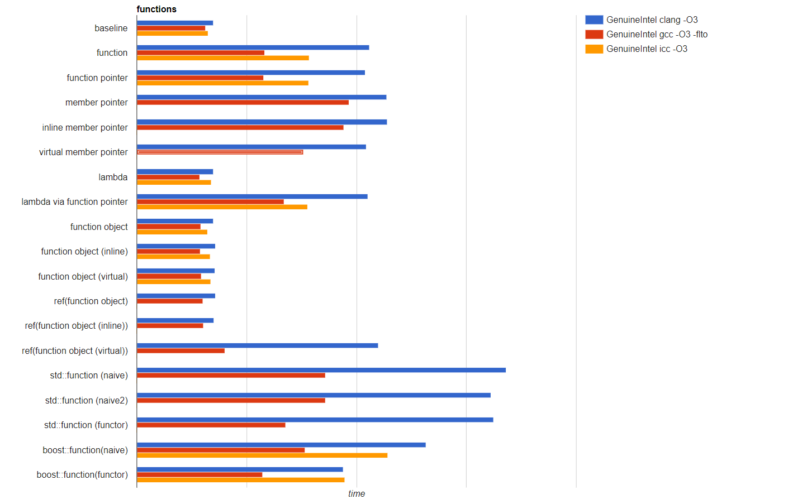

# [Delegate this! Designing with delegates in modern C++](https://channel9.msdn.com/Events/GoingNative/CppCon-2017/061)

1. [Member Function Pointers and the Fastest Possible C++ Delegates](https://www.codeproject.com/Articles/7150/Member-Function-Pointers-and-the-Fastest-Possible)
2. [The Impossibly Fast C++ Delegates](https://www.codeproject.com/Articles/11015/The-Impossibly-Fast-C-Delegates)
3. [The Impossibly Fast C++ Delegates, Fixed](https://www.codeproject.com/Articles/1170503/The-Impossibly-Fast-Cplusplus-Delegates-Fixed)
4. [Generic C++ delegates](https://nikitablack.github.io/2016/04/12/Generic-C-delegates.html)
5. [Fast delegates implementation](https://github.com/mamedev/delegates)
6. [Impossibly fast delegate in C++11](https://codereview.stackexchange.com/questions/14730/impossibly-fast-delegate-in-c11)

## 美好的旧日时光

调用1个函数需要耗费多少代价?如果你用C语言,也就一个跳转指令再加上参数压栈操作,函数作为指针存在,不用关心入参和出参,你可以将一个指针转换成各种不同的函数原型,使用起来也非常简单：

```C
;

int compare(const void*,const void*);

void sort_demo(int (*cmp_fn)(const void*,const void*)){
    qsort(array,array_size,value_size,cmp_fn);
}
void use_cmp_fn(){
    int (*cmp_fn)(const void*,const void*);
    cmp_fn = &compare;
    sort_demo(cmp_fn);
}
```

然而在C++里这一切都变得复杂起来。

## 复杂的C++

在C++中专门有个概念`[Callable](https://en.cppreference.com/w/cpp/named_req/Callable)`来表示可调用对象,可数调用的就有以下几种：

- 全局函数
- 成员函数
- 仿函数
- Lambda

每种又有不同的使用场景和行为：

- 全局函数：行为与C语言中的函数一致
- 成员函数: 成员函数必须有类实例才能调用,所以需要注意其生命周期和调用语法
- 仿函数: 作为类存在,只是定义了`operator()`,能够执行调用行为
- Lambda: 目标就是书写临时函数,可能依赖于外部变量,主要用在即时声明即时使用

针对成员函数,由于成员函数可能被`&`、`&&`、`const`、`noexcept`等修饰,其情况更为复杂。

## 那么问题是什么

**overhead**! 一方面开发者想要使用C++的对象、仿函数、Lamdda等内容,另外一方面又不想付出不必要的成本,他们只想要一个通用、简单、没用不必要的性能损耗的函数调用。

那么C++中有这种东西么?你或许会说`std::function`,抑或是用模板实现,我们先来看看[已有的性能分析](http://www.dietmar-kuehl.de/cputube/functions.html)：


在[passing functions to functions](https://vittorioromeo.info/index/blog/passing_functions_to_functions.html)中对通过各种方式实现将函数传递给函数进行了举例说明,我们先来看看基准情况下的代码和其汇编结果:

```C++
volatile int state = 0;
int main(){
    state = 1;
    return state;
}
```

其编译出的结果是：

```asm
main:
        mov     DWORD PTR state[rip], 1
        mov     eax, DWORD PTR state[rip]
        ret
state:
        .zero   4
```

使用函数指针：

```C++
volatile int state = 0;

void f(void(*x)(volatile int&)){
    x(state);
}
int main(){
    f([](volatile auto&y){y=1;});
    return state;
}
```

其编译出的结果为：

```ASM
f(void (*)(int volatile&)):
        mov     rax, rdi
        mov     edi, OFFSET FLAT:state
        jmp     rax
main:
        mov     DWORD PTR state[rip], 1
        mov     eax, DWORD PTR state[rip]
        ret
state:
        .zero   4
```

使用模板:

```C++

template<typename TF>
void f(TF&& x){
    x(state);
}
```

其编译出的结果为：

```ASM
main:
        mov     DWORD PTR state[rip], 1
        mov     eax, DWORD PTR state[rip]
        ret
state:
        .zero   4
```

使用`std::function`:

```C++
void f(std::function<void(volatile int&)> x){
    x(state);
}
```

其编译出的结果为:

```ASM
std::_Function_handler<void (int volatile&), main::{lambda(auto:1 volatile&)#1}>::_M_invoke(std::_Any_data const&, int volatile&):
        mov     DWORD PTR [rsi], 1
        ret
std::_Function_base::_Base_manager<main::{lambda(auto:1 volatile&)#1}>::_M_manager(std::_Any_data&, std::_Function_base::_Base_manager<main::{lambda(auto:1 volatile&)#1}> const&, std::_Manager_operation):
        cmp     edx, 1
        ja      .L4
        je      .L5
        mov     QWORD PTR [rdi], OFFSET FLAT:typeinfo for main::{lambda(auto:1 volatile&)#1}
.L4:
        xor     eax, eax
        ret
.L5:
        mov     QWORD PTR [rdi], rsi
        xor     eax, eax
        ret
f(std::function<void (int volatile&)>):
        cmp     QWORD PTR [rdi+16], 0
        je      .L11
        mov     rax, QWORD PTR [rdi+24]
        mov     esi, OFFSET FLAT:state
        jmp     rax
.L11:
        push    rax
        call    std::__throw_bad_function_call()
main:
        sub     rsp, 56
        mov     edx, 3
        mov     DWORD PTR state[rip], 1
        mov     QWORD PTR [rsp+8], OFFSET FLAT:std::_Function_base::_Base_manager<main::{lambda(auto:1 volatile&)#1}>::_M_manager(std::_Any_data&, std::_Function_base::_Base_manager<main::{lambda(auto:1 volatile&)#1}> const&, std::_Manager_operation)
        movq    xmm0, QWORD PTR [rsp+8]
        lea     rsi, [rsp+16]
        mov     rdi, rsi
        movhps  xmm0, QWORD PTR .LC0[rip]
        movaps  XMMWORD PTR [rsp+32], xmm0
        call    std::_Function_base::_Base_manager<main::{lambda(auto:1 volatile&)#1}>::_M_manager(std::_Any_data&, std::_Function_base::_Base_manager<main::{lambda(auto:1 volatile&)#1}> const&, std::_Manager_operation)
        mov     eax, DWORD PTR state[rip]
        add     rsp, 56
        ret
typeinfo for main::{lambda(auto:1 volatile&)#1}:
        .quad   vtable for __cxxabiv1::__class_type_info+16
        .quad   typeinfo name for main::{lambda(auto:1 volatile&)#1}
typeinfo name for main::{lambda(auto:1 volatile&)#1}:
        .string "*Z4mainEUlRVT_E_"
state:
        .zero   4
.LC0:
        .quad   std::_Function_handler<void (int volatile&), main::{lambda(auto:1 volatile&)#1}>::_M_invoke(std::_Any_data const&, int volatile&)
```

可以看到模板(inline)的效果最好,其次是函数指针,而`std::function`比较糟糕,因为`std::function`可能需要申请存储空间来保存可调用对象,带来一部分性能上的影响,如果出现在性能关键路径,还是不可小觑的。

## 先来聊聊怎么在C++中实现`delegate`

### 函数指针的版本

```C++
template<typename T>
class delegate;

template<typename R,typename... Args>
class delegate
{
    using callable_t = R(*)(Args...);
    callable_t callback;
public:
    template<typename F,typename = std::enable_if_t<std::is_invocable<F,Args...>::value>
    delegate(F&& fn)
        :callback(fn)
    {}

    R operator()(Args...){
        return callback(std::forward<Args>(args)...);
    }
};

```

使用方式如下：

```C++
int callme();

void demo(){
    delegate<decltype(callme)> fn(callme);
    auto result = fn();
}
```

### 成员函数版本实现

成员函数比较麻烦,需要有类实例才可以调用,单独的成员函数版本`delegate`实现如下：

```C++
template<typename R,typename... Args>
class delegate
{
    using callable_t = R(*)(void* callee,Args...);
    void* callee;
    callable_t callback;
public:
    template<typename T>
    delegate(const& T object,R(T::*fun)(Args...))
        :callee{static_cast<void*>(&object)},callback{&member_fun(&object,fun)}
    {}
private:
    template<typename T,R(T::*fun)(Args...)>
    static R member_fun(void* callee,Args...){
        return ((static_cast<T*>(callee))->*fun)(std::forward<Args>(args)...);
    };
};
```

而之前函数指针的版本就会被修改如下：

```C++
template<typename R,typename... Args>
class delegate
{
public:
    template<R(*fun)(Args...)>
    delegate(fun&& fn)
        :callee{nullptr},callback{&global_fun}
    {}
private:
    template<R(*fun)(Args...)>
    static R global_fun(void* callee,Args...){
        return fun(std::forward<Args>(args)...);
    }
};
```

### 如何处理仿函数与Lambda

仿函数和Lambda所面临的声明周期问题更为明显,从之前的代码可以看到,成员函数指针版的保存了类实例的地址,也就是说其在整个生命周期必须存在才可以,而仿函数和Lambda是即用即实例的,如果需要让`delegate`支持,需要复制一份实例保存到`delegate`中,这样就会导致即使在常规情况下,`delegate`也会超过两个指针大小,没办法做到避免`overhead`,使用时又要小心翼翼,得不偿失,不过依然可以实现,具体参考[Impossibly fast delegate in C++11](https://codereview.stackexchange.com/questions/14730/impossibly-fast-delegate-in-c11)。

## 聊一聊`overhead`的问题

由于`std::function`自身存在的`overhead`,因而有人提出了`[function_ref](http://www.open-std.org/jtc1/sc22/wg21/docs/papers/2017/p0792r0.html)`这种类似于`string_view`的函数引用,自身不是函数拥有者,以此来避免不必要的成本,但是也会带来生命周期等等各种情况,使得其应用非常局限,对开发者提出了"过高"的要求,我对这种方案并不看好。

但是,根据演讲中所提到的应用场景,这种`overhead`确实不能忍受,为什么会需要学习模板、元编程等技巧,无非是在那些真正需要追求极高性能,不希望有不必要的损耗时,能够有对应的解决方案。