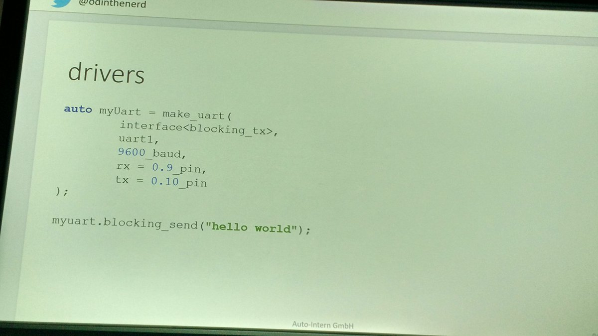

# Weekly ARTS

## Algorithm [3SumCloest](3SumClosest.md)

给定整数数组及目标值,求出最接近目标的三个整数和,主要考察的是利用已排序特性将二层循环展开成一层。

## Review [C++ Core Guidelines: Rules for Error Handling](http://www.modernescpp.com/index.php/c-core-guidelines-rules-to-error-handling)

写程序难免有BUG,出现错误时需要使用恰当的处理方式,错误的处理涉及以下方面：

- 检测错误
- 将错误信息传递给处理代码
- 使程序处于有效状态
- 避免资源泄漏

C语言提供的错误机制是错误码,而C++针对错误处理提供的机制是异常,[David Abrahams](https://en.wikipedia.org/wiki/David_Abrahams_(computer_programmer))在[Exception-Safety in Generic Components](https://www.boost.org/community/exception_safety.html)中提出了异常安全的概念,这里有从强到弱四个等级的异常安全保证:

1. No-throw guarantee 无故障保证
> 操作保证会执行成功而且能够满足所有要求,即使在特殊情况的情况下.如果异常发生,操作也能够在内部正确处理,而不会被发现出现错误。
2. Strong exception safety 增强保证
>操作有可能失败,但是失败的操作能够保证没有任何副作用,即所有数据保持其原始值。
3. Basic exception safety 基本异常保证
>部分操作失败可以引起副作用,但是没有资源泄漏.任何存储的数据即使其与异常前不一样,也能保证其处于有效状态。
4. No exception safety 无异常保证
>不对操作进行任何保证

在具体实践中编写异常安全代码是比较困难的,我们应当极可能提供更强的异常安全保证,至少也是基本异常保证。

文中谈到了几条建议：

- 从设计之初就要制定错误处理策略:出现错误如何处理,模块要提供什么样的异常保证,使用异常还是错误码,日志记录等等等等
- 抛出异常来告知函数无法实现要求的功能:譬如前置条件不满足、构造函数无法成功构造、超出范围、无法获取请求的资源等
- 异常仅用于错误处理:异常设计出来就是处理错误的,不要将其作为`goto`使用

实际上关于C++的错误处理一直有很多不同的声音,也有很多不同的实践：

- 错误码：由于异常机制存在一些运行环境和性能上的要求,在某些场景下异常是被禁用的,通过返回错误码来进行错误处理
- `std::error_code`:用来表示平台相关错误码,典型应用为Boost.Asio,每个函数会有两个重载：返回错误码、抛出异常
- `std::expected<T,E>`:采用返回错误码的方式会污染函数声明,如果函数可能发生错误,那么可以使用`std::expected<T,E>`,正常情况下返回`T`,出错的情况下范围错误码`E`
- `boost::outcome<T>`:感觉上与`std::expected<T,E>`类似,但是设计理念上有所不同

在5月份,Herb Sutter提供了一份新的提案[Zero-overhead deterministic exceptions: Throwing values](www.open-std.org/jtc1/sc22/wg21/docs/papers/2018/p0709r0.pdf),对C++现存的错误处理方法进行了梳理和思考,并提出了新的错误处理方案来尝试解决现有的错误处理方法的问题,非常值得一读。

在当下,我们有哪些可以参考的错误处理原则呢：

- 使用断言来检查不应该发生的错误,使用异常来检查可能会发生的错误
- 对于每个可能引发或者传播异常的函数,提供异常保证
- 通过值引发异常,通过引用捕获,不要捕获无法处理的异常
- 使用标准库异常类型,或者从异常类派生出自定义异常
- 不允许在析构函数里抛出异常

在C++20中将会提供`contract`,试图来解决困扰已久的C++运行时崩溃等易发BUG,后续会提供相关解读。

## Technique [ADL](ADL.md)

聊一聊C++中常常讲到,或者源代码中写的ADL是什么意思,怎么使用。

## Share 嵌入式系统-"被遗忘的角落"?

在数年之前,我还在苦心折腾嵌入式系统,用两个端口模拟IIC协议等等,ARM火起来后,开始使用恩智浦的STM32xxx系列芯片,与现在在PC机上写程序是完全不同的体验：连printf都没得用,更别说各种标准库之类,基本上都要自行实现。

已经是很久之前的事情了......不知道现在用嵌入式系统做物联网等等应用的是什么样的开发体验,是不是还是要这样玩：

由于嵌入式系统上资源的相对匮乏,大部分人还是用C语言开发,虽然芯片厂商一直在努力提供相关的库,进行开发时依然比较麻烦; **如果你觉得现在写程序很艰难,要学的东西太多,可以去挑战一下嵌入式系统**.

我也关注到一些使用JavaScript等等进行嵌入式开发的解决方案,很有思路;但是,连个C++都不大能用得上,还要去用JavaScript?怕不是只能用用树莓派发个微博浇浇花吧。

所幸C++专家们一直没有放弃这个领域,还在努力尝试,譬如利用了各种C++模板技术实现的辅助库：

兼具表现能力和效率,相见恨晚,在现在软件开发各种语言及方法层出不穷的情况下, **嵌入式系统不是处于被遗忘的角落,还有C++来帮助我们**。

感兴趣的可以去看看[Odin Holmes “C++ Mixins: Customization Through Compile Time Composition”](https://www.youtube.com/watch?v=wWZi_wPyVvs)