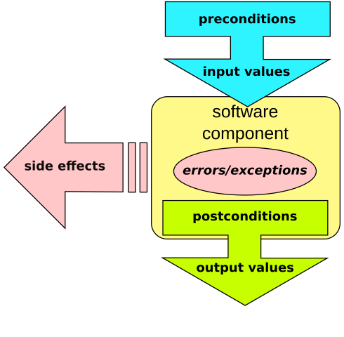

# 关于C++20的`contract`

标准提案: [Support for contract based programming in C++](http://www.open-std.org/jtc1/sc22/wg21/docs/papers/2018/p0542r5.html)

总结的阅读列表: [为什么要了解contract以及阅读列表](https://github.com/liff-engineer/WeeklyARTS/blob/master/isocpp/proposals/Contracts.md)

说起`contracts`,可以拿这张图聊起：

我们编码最终会细分成function,而一个函数,执行前需要前置条件,入参,执行过程中会发生错误或者抛出异常,执行完成后按照功能约束它必须满足后置条件,然后输出结果;函数执行过程中会有side effects（异常安全保证了解一下:joy:）

大家都了解的assert就是用来确保运行时某个条件（前置、过程中、后置）必须要满足。

assert是个宏,其实现一般是在debug模式下,不满足条件就终止应用程序;而release模式下,通过预处理assert内容不会生成.

由于assert是个宏,所以大家肯定听说过在assert语句中不要做有side effect的事情.

而针对模板,C++11提供了 static_assert来实现编译期assert.

为了编写比较健壮的应用程序,编码时会处理各种错误场景,从而导致在某些情况下错误处理代码比正常流程都多;实际上一些错误处理代码并不必须
譬如空指针检查,为了求稳,基本上每级函数调用都会做保护动作,毕竟不知道别人传入参数时是什么情况;这样的写法在很多数场景下并无必要,而且会带来性能损耗（指令预取、分支预测）

所以,基于这种情况,就有人提出了`contract`：基于合约编码; 每个function可以约束其前置条件、过程中约束、后置条件;这些限定条件可以配置,类似于log的等级,而编译结果也是根据对应的 `contract` level 来移除对应的条件语句.

在常规开发过程中,编译器会生成类似的手写代码,一旦出现不满足约束,就会通过设定的处理 `handler` 记录下出问题的位置,或者直接中止;一旦通过测试,这些属于`contract`的内容都会被编译器移除;在真正发布的应用程序中,不会存在不应当存在的错误处理代码.

为什么Herb Sutter会说,这个标准提案会带来 *正确性* 和 *性能* 的巨大提升：正确性方面,有标准化的方式来书写前置、后置等等约束;性能方面,理想情况下很多错误处理代码不再存在.

很多C++异常都不再需要抛出,你可以将function标注为noexcept ,这时编译器就能够帮你优化一下（异常支持需要stack unwinding）

了解了这个,大家可以再读读 Herb Sutter的Trip report,看看他说的你能否认同.
